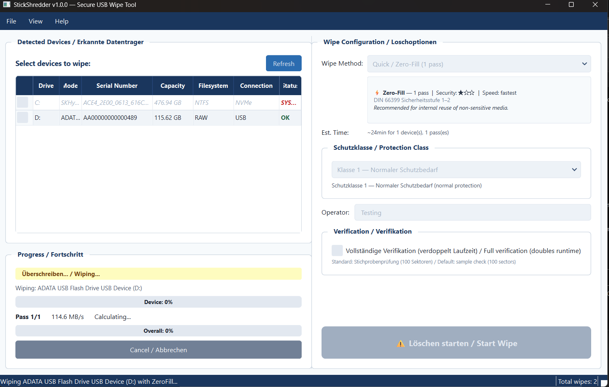
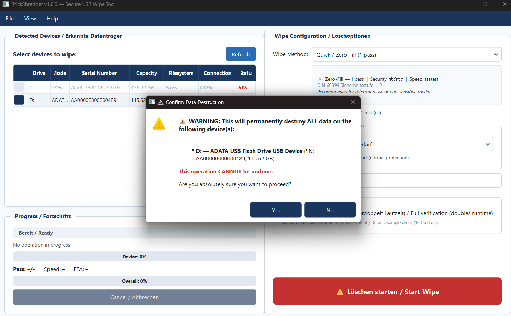
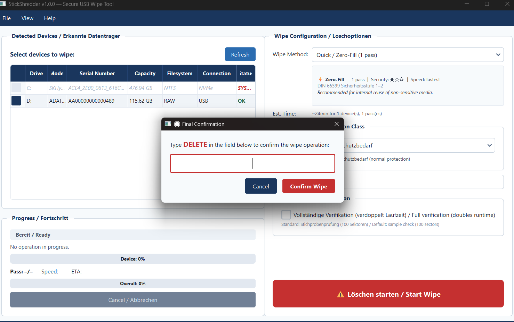
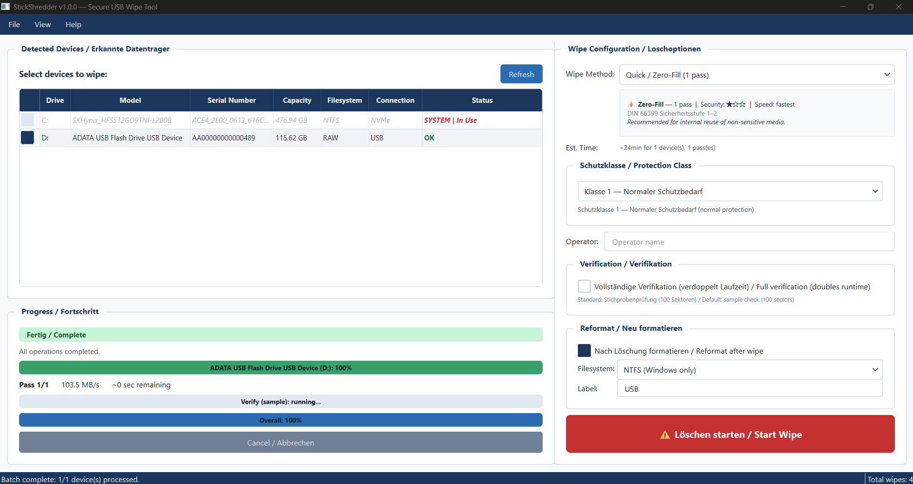

<h1 align="center">StickShredder</h1>

<p align="center"><strong>Secure USB wipe tool with DIN 66399 / ISO 21964 deletion certificates</strong></p>

<p align="center">
  <a href="LICENSE"></a>
  
  
</p>

<p align="center">
  
</p>
<p align="center"><em>Wiping a 128 GB USB stick — phase badge, live progress, ETA, and an auto-generated DIN 66399 deletion certificate at the end.</em></p>

---

## Table of Contents

- [What is StickShredder?](#what-is-stickshredder)
- [Important Disclaimer](#important-disclaimer)
- [Features](#features)
- [Screenshots](#screenshots)
- [Installation](#installation)
- [Quick Start](#quick-start)
- [Wipe Methods](#wipe-methods)
- [DIN 66399 Explained](#din-66399-explained)
- [SSD Limitations](#ssd-limitations)
- [FAQ](#faq)
- [Contributing](#contributing)
- [License](#license)
- [Deutsch](#deutsch)

---

## What is StickShredder?

StickShredder is a free, open-source Windows tool for securely wiping USB drives and generating deletion certificates structured according to DIN 66399 / ISO 21964 conventions. It is designed for German IT administrators in small and medium-sized businesses (SMBs) who need to document the secure disposal of data on removable media.

Existing alternatives fall short in this space: **nwipe** is Linux-only and requires booting into a separate environment, **Eraser** does not generate deletion certificates, and **commercial certified tools** such as Blancco often cost EUR 200+ per year in licensing fees. StickShredder fills this gap by providing a straightforward GUI and CLI for secure USB wipes with professional, PDF-based deletion certificates -- all under an MIT license.

---

## Important Disclaimer

> **StickShredder is NOT DIN 66399 certified.**
>
> This software generates deletion reports that are *structured according to* DIN 66399 / ISO 21964 conventions. The deletion certificates reference the standard's terminology (Schutzklassen, Sicherheitsstufen, media types) to provide a useful, standards-aware documentation format.
>
> However, StickShredder has **not been officially audited or certified** by DEKRA, DIN, BSI, or any other certification body. The certificates it produces do not constitute proof of compliance with DIN 66399 in a legal or regulatory sense.
>
> This is open-source software provided under the MIT license, without warranty of any kind. For data subject to strict regulatory requirements, consult your data protection officer and consider using certified commercial tools or physical destruction.

---

## Features

- **Secure wipe of USB drives** with multiple overwrite methods (Zero-Fill, Random, BSI VSITR, Custom)
- **DIN 66399 / ISO 21964 structured deletion certificates** as PDF, including device serial number, wipe method, timestamp, and operator information
- **Modern GUI** built with PySide6 (Qt6) -- intuitive, no training required
- **CLI mode** for scripting and batch operations
- **Multiple wipe methods** with configurable pass counts
- **Real-time progress tracking** with estimated time remaining
- **Drive detection** via WMI -- automatically identifies connected USB devices
- **Safety guard** -- refuses to wipe system drives by design
- **Portable** -- no installation required (standalone .exe via PyInstaller)
- **100% offline** -- no network access, no telemetry, no cloud dependency
- **Free and open source** under the MIT license

---

## Screenshots

A full wipe walks the operator through **two confirmations, a live progress view, and a success dialog** — with a PDF certificate dropped in the output folder at the end.

<table>
  <tr>
    <td width="50%" valign="top">
      <p align="center"><strong>① Confirm destructive action</strong></p>
      
      <p align="center"><sub>Dialog restates the exact drive letter, model, serial, and capacity about to be destroyed.</sub></p>
    </td>
    <td width="50%" valign="top">
      <p align="center"><strong>② Type DELETE to proceed</strong></p>
      
      <p align="center"><sub>Second confirmation blocks accidental one-click wipes. No DELETE typed &rarr; no wipe.</sub></p>
    </td>
  </tr>
  <tr>
    <td width="50%" valign="top">
      <p align="center"><strong>③ Wipe + verify in progress</strong></p>
      
      <p align="center"><sub>Phase badge, pass counter, throughput, ETA. A stall watchdog warns within 60 seconds if the controller hangs.</sub></p>
    </td>
    <td width="50%" valign="top">
      <p align="center"><strong>④ Success + certificate</strong></p>
      
      <p align="center"><sub>PDF certificate auto-saved to the configured output folder. Ready for audit.</sub></p>
    </td>
  </tr>
</table>

Full-resolution images: [`docs/screenshots/`](docs/screenshots/). Example certificate: [`docs/examples/sample-certificate.pdf`](docs/examples/sample-certificate.pdf).

---

## Installation

### Option A: Download the Installer

Download the latest release from the [Releases](https://github.com/rctom16-bit/stickshredder/releases) page. Run the installer or extract the portable `.zip` and launch `StickShredder.exe`.

### Option B: Build from Source

Requires **Python 3.11+** and **Windows**.

```bash
# Clone the repository
git clone https://github.com/rctom16-bit/stickshredder.git
cd stickshredder

# Install dependencies
pip install -e ".[dev]"

# Run directly
python -m src.main

# Build standalone executable
pyinstaller installer/stickshredder.spec
```

The built executable will be in the `dist/` folder.

---

## Quick Start

### GUI

1. Launch `StickShredder.exe` (or `python -m src.main`)
2. Insert the USB drive you want to wipe
3. Select the drive from the device list
4. Choose a wipe method (e.g., "3-Pass Random")
5. Click **Wipe** and confirm the safety prompt
6. After completion, the deletion certificate is generated automatically as a PDF

### CLI

```bash
# List connected USB devices
stickshredder --list

# Wipe drive E: with 3-pass random overwrite
stickshredder --drive E: --method random3

# Wipe with BSI VSITR method and save certificate to a specific path
stickshredder --drive E: --method vsitr --cert-output "C:\Certificates\wipe_2026-04-16.pdf"
```

> **Note:** Administrator privileges are required. Right-click and select "Run as administrator" or use an elevated terminal.

---

## Wipe Methods

| Method | Passes | Pattern | DIN 66399 Level | Verify Support | Use Case |
|---|---|---|---|---|---|
| **Zero-Fill** | 1 | `0x00` | H-1 / H-2 | sample, full | Quick wipe for non-sensitive data, device reuse within the organization |
| **3-Pass Random** | 3 (+1) | Cryptographic random data | H-3 | sample, full | Standard wipe for normal business data (Schutzklasse 1-2) |
| **BSI VSITR** | 7 (+1) | Alternating `0x00` / `0xFF` + random final pass | H-4 | sample, full | Enhanced wipe per BSI VSITR standard, recommended for confidential data |
| **Custom** | User-defined | User-defined pattern and pass count | Varies | sample, full | Flexible configuration for specific organizational requirements |

> **Note on `(+1)`:** When verification is enabled for random-data methods, StickShredder appends one zero-blanking pass after the final random pass so the result can be verified byte-by-byte. Without this extra pass, random data is indistinguishable from corrupted data without storing the PRNG seeds. See [Verification Modes](#verification-modes) below.

> **Note:** For SSDs and flash-based USB drives, overwrite-based methods have inherent limitations due to wear leveling. See [SSD Limitations](#ssd-limitations) and [SECURITY.md](docs/SECURITY.md).

> **Optional reformat:** After any wipe method, StickShredder can automatically create a fresh partition and format the drive (FAT32 / exFAT / NTFS) so it is immediately usable without a trip through Disk Management. See [Reformat After Wipe](#reformat-after-wipe).

---

## Verification Modes

After a wipe finishes, StickShredder can read the drive back to prove the overwrite actually took effect. There are three modes:

| Mode | Runtime Cost | What It Does | When to Use |
|---|---|---|---|
| `none` | 0% | Skip verification entirely | You trust the drive and don't need a signed verification record |
| `sample` (default) | ~1% | Reads 100 random sectors, hashes them, compares to the expected pattern | Standard use — fast, catches most large-scale failures |
| `full` | ~100% (doubles runtime) | Reads **every** sector and compares against the expected pattern; reports the first 100 mismatching byte offsets | Regulatory audits, silent-sector-failure detection, high-value drives |

**Why full verify matters.** Overwrite-based wipes assume each `WriteFile` that returns success actually committed data to the media. On aging flash or failing USB controllers, some sectors can "silently fail" — writes appear to succeed, but old content is still present when you read it back. Only full verify catches this.

**Zero-blanking pass for random methods.** When verification is enabled (either `sample` or `full`) and the selected method ends on a random pass — **3-Pass Random** or **BSI-VSITR** — StickShredder automatically appends one final zero-blanking pass so the drive can be verified against a known pattern (`0x00`). This is why the methods table shows `3 (+1)` and `7 (+1)`: BSI-VSITR runs 7 nominal passes, plus one zero-pass, for **8 passes total** when verification is on. The appended pass is recorded on the certificate (actual pass count) and in the CSV history.

**CLI:**

```bash
# Sample verify (default — same as 1.0.x behavior)
stickshredder wipe --device E: --method standard --operator "Robin"

# Full verify — roughly doubles the total runtime
stickshredder wipe --device E: --method standard --operator "Robin" --verify full

# Skip verification entirely
stickshredder wipe --device E: --method zero --operator "Robin" --verify none
```

**GUI:** tick the *"Full verification (doubles runtime)"* checkbox in the wipe configuration panel. Without the checkbox, the GUI still performs sample verification by default.

---

## Reformat After Wipe

By default, StickShredder leaves the drive in a raw (unpartitioned) state after wiping. Windows will show it as an "Unallocated" drive you cannot use until you format it manually in Disk Management.

For convenience, StickShredder can reformat the drive immediately after a successful wipe+verify:

| Filesystem | Size Limits | Compatibility |
|---|---|---|
| **exFAT** (recommended) | Up to 128 PB | Windows, macOS, most Linux, cameras, game consoles |
| **FAT32** | 32 GB per volume, 4 GB per file | Near-universal, but capped at 32 GB — Windows refuses to create FAT32 above that |
| **NTFS** | 256 TB | Windows-first; macOS and Linux need plugins for write support |

**CLI:**
```bash
stickshredder wipe --device E: --method zero --operator "Robin" --reformat exfat --reformat-label "Archive-2026"
```

**GUI:** tick **"Nach Löschung formatieren / Reformat after wipe"** in the Wipe Configuration panel and choose the filesystem and volume label.

If reformat fails (e.g., Windows refuses to format FAT32 on a drive >32 GB), the wipe itself is still reported successful and the certificate is still generated — only the reformat step is logged as failed.

---

## DIN 66399 Explained

DIN 66399 (also published as ISO 21964) is the German/international standard for the destruction of data carriers. It defines:

- **Schutzklassen (Protection Classes)** 1-3: How sensitive is the data?
- **Sicherheitsstufen (Security Levels)** 1-7: How thoroughly must the data be destroyed?
- **Media types** (P, F, O, T, H, E): What kind of data carrier is it?

StickShredder operates on media type **H** (hard drives / digital storage) and maps its wipe methods to the corresponding security levels.

For a detailed explanation, see [docs/DIN66399-INFO.md](docs/DIN66399-INFO.md).

---

## SSD Limitations

Modern USB drives and SSDs use **wear leveling**, **over-provisioning**, and **controller-managed block remapping**. These techniques mean that a software-based overwrite may not reach every physical memory cell on the device. Residual data may persist in remapped or reserved blocks that are inaccessible to the host operating system.

**For high-sensitivity data on SSD/flash media**, consider:

- **ATA Secure Erase** (planned for a future version of StickShredder)
- **Physical destruction** (shredding per DIN 66399 media type E)

For a detailed discussion, see [docs/SECURITY.md](docs/SECURITY.md).

---

## FAQ

### Is this really DIN 66399 certified?

**No.** StickShredder is not certified by DEKRA, DIN, BSI, or any other body. The deletion certificates it generates are *structured according to* DIN 66399 / ISO 21964 terminology and conventions, but they do not constitute official DIN 66399 compliance. If your organization requires a certified tool, you will need a commercially certified solution.

### Do I need administrator rights?

**Yes.** Writing raw data to an entire drive requires elevated privileges on Windows. StickShredder will prompt for a UAC elevation if not already running as administrator.

### Can I wipe my system drive?

**No, by design.** StickShredder explicitly refuses to wipe any drive that contains the active Windows installation or any mounted system partition. It is intended exclusively for removable USB media.

### Which file systems are supported?

StickShredder performs a raw, sector-level overwrite of the entire drive. The existing file system is irrelevant -- it will be destroyed during the wipe. You can reformat the drive with any file system afterwards.

### Can I use this for GDPR / DSGVO compliance?

StickShredder can be a useful part of your data disposal process, but it is not a complete GDPR compliance solution on its own. Consult your data protection officer (Datenschutzbeauftragter) to determine whether software-based wiping meets your specific regulatory obligations.

### Is the deletion certificate legally binding?

The certificate is a documentation tool. Its legal standing depends on your jurisdiction and the specific requirements of your regulatory framework. It is not a substitute for professional legal advice.

---

## Contributing

Contributions are welcome! To get started:

1. Fork the repository
2. Create a feature branch (`git checkout -b feature/my-feature`)
3. Install development dependencies: `pip install -e ".[dev]"`
4. Make your changes and add tests
5. Run the test suite: `pytest`
6. Submit a pull request

Please follow the existing code style and include tests for any new functionality. For larger changes, open an issue first to discuss the approach.

### Reporting Bugs

Open an issue on GitHub with:
- Your Windows version
- Python version (if running from source)
- Steps to reproduce
- Expected vs. actual behavior

---

## License

StickShredder is licensed under the [MIT License](LICENSE).

---
---

## Deutsch

# StickShredder

**Sicheres USB-Löschtool mit DIN 66399 / ISO 21964 Löschzertifikaten**

<!-- Badges -->
[](LICENSE)


---

### Inhaltsverzeichnis

- [Was ist StickShredder?](#was-ist-stickshredder)
- [Wichtiger Hinweis](#wichtiger-hinweis)
- [Funktionen](#funktionen)
- [Screenshots](#screenshots-1)
- [Installation](#installation-1)
- [Schnellstart](#schnellstart)
- [Löschmethoden](#löschmethoden)
- [DIN 66399 erklärt](#din-66399-erklärt)
- [SSD-Einschränkungen](#ssd-einschränkungen)
- [Häufige Fragen (FAQ)](#häufige-fragen-faq)
- [Mitwirken](#mitwirken)
- [Lizenz](#lizenz-1)

---

### Was ist StickShredder?

StickShredder ist ein kostenloses, quelloffenes Windows-Tool zum sicheren Löschen von USB-Datenträgern mit anschließender Erstellung von Löschzertifikaten nach DIN 66399 / ISO 21964. Es richtet sich an IT-Administratoren in kleinen und mittleren Unternehmen (KMU), die die datenschutzkonforme Entsorgung von Daten auf Wechseldatenträgern dokumentieren müssen.

Bestehende Alternativen decken diesen Bedarf nur unzureichend ab: **nwipe** ist Linux-basiert und erfordert das Booten einer separaten Umgebung, **Eraser** erstellt keine Löschzertifikate, und **kommerzielle zertifizierte Tools** wie Blancco kosten häufig 200+ EUR pro Jahr an Lizenzgebühren. StickShredder schließt diese Lücke mit einer intuitiven GUI und CLI für sicheres USB-Löschen und professionellen PDF-Löschzertifikaten -- alles unter der MIT-Lizenz.

---

### Wichtiger Hinweis

> **StickShredder ist NICHT DIN 66399 zertifiziert.**
>
> Diese Software erstellt Löschberichte, die *nach den Konventionen* der DIN 66399 / ISO 21964 strukturiert sind. Die Löschzertifikate verwenden die Terminologie des Standards (Schutzklassen, Sicherheitsstufen, Datenträgertypen), um ein nützliches, standardnahes Dokumentationsformat bereitzustellen.
>
> StickShredder wurde jedoch **nicht offiziell von DEKRA, DIN, BSI oder einer anderen Zertifizierungsstelle geprüft oder zertifiziert**. Die erstellten Zertifikate stellen keinen Nachweis der Konformität mit DIN 66399 im rechtlichen oder regulatorischen Sinne dar.
>
> Dies ist quelloffene Software unter der MIT-Lizenz, ohne jegliche Gewährleistung. Für Daten, die strengen regulatorischen Anforderungen unterliegen, wenden Sie sich an Ihren Datenschutzbeauftragten und ziehen Sie den Einsatz zertifizierter kommerzieller Tools oder die physische Vernichtung in Betracht.

---

### Funktionen

- **Sicheres Löschen von USB-Datenträgern** mit mehreren Überschreibmethoden (Zero-Fill, Random, BSI VSITR, Benutzerdefiniert)
- **Löschzertifikate nach DIN 66399 / ISO 21964** als PDF, inkl. Geräteseriennummer, Löschmethode, Zeitstempel und Bedienerinformationen
- **Moderne GUI** mit PySide6 (Qt6) -- intuitiv, ohne Schulung nutzbar
- **CLI-Modus** für Skripte und Stapelverarbeitung
- **Mehrere Löschmethoden** mit konfigurierbarer Durchlaufanzahl
- **Echtzeit-Fortschrittsanzeige** mit geschätzter Restdauer
- **Laufwerkserkennung** via WMI -- erkennt automatisch angeschlossene USB-Geräte
- **Sicherheitssperre** -- verweigert das Löschen von Systemlaufwerken (by Design)
- **Portabel** -- keine Installation erforderlich (eigenständige .exe via PyInstaller)
- **100% offline** -- kein Netzwerkzugriff, keine Telemetrie, keine Cloud-Abhängigkeit
- **Kostenlos und quelloffen** unter der MIT-Lizenz

---

### Screenshots

Ein vollständiger Löschvorgang führt den Bediener durch **zwei Bestätigungen, eine Live-Fortschrittsanzeige und einen Erfolgsdialog** — und erzeugt am Ende ein PDF-Zertifikat im Ausgabeordner.

<table>
  <tr>
    <td width="50%" valign="top">
      <p align="center"><strong>① Zerstörerische Aktion bestätigen</strong></p>
      
      <p align="center"><sub>Der Dialog nennt Laufwerksbuchstaben, Modell, Seriennummer und Kapazität des Ziels noch einmal ausdrücklich.</sub></p>
    </td>
    <td width="50%" valign="top">
      <p align="center"><strong>② DELETE eingeben</strong></p>
      
      <p align="center"><sub>Die zweite Bestätigung verhindert versehentliche Ein-Klick-Löschungen. Ohne „DELETE" kein Löschvorgang.</sub></p>
    </td>
  </tr>
  <tr>
    <td width="50%" valign="top">
      <p align="center"><strong>③ Löschen + Verifikation</strong></p>
      
      <p align="center"><sub>Phasen-Anzeige, Durchlaufzähler, Durchsatz, Restdauer. Ein Stall-Watchdog meldet innerhalb von 60 Sekunden, wenn der Controller hängt.</sub></p>
    </td>
    <td width="50%" valign="top">
      <p align="center"><strong>④ Erfolg + Zertifikat</strong></p>
      
      <p align="center"><sub>Das PDF-Zertifikat wird automatisch im konfigurierten Ausgabeordner gespeichert. Bereit für die Prüfung.</sub></p>
    </td>
  </tr>
</table>

Bilder in voller Auflösung: [`docs/screenshots/`](docs/screenshots/). Beispielzertifikat: [`docs/examples/sample-certificate.pdf`](docs/examples/sample-certificate.pdf).

---

### Installation

#### Variante A: Installer herunterladen

Laden Sie die aktuelle Version von der [Releases](https://github.com/rctom16-bit/stickshredder/releases)-Seite herunter. Führen Sie den Installer aus oder entpacken Sie die portable `.zip`-Datei und starten Sie `StickShredder.exe`.

#### Variante B: Aus dem Quellcode erstellen

Erfordert **Python 3.11+** und **Windows**.

```bash
# Repository klonen
git clone https://github.com/rctom16-bit/stickshredder.git
cd stickshredder

# Abhängigkeiten installieren
pip install -e ".[dev]"

# Direkt ausführen
python -m src.main

# Eigenständige .exe erstellen
pyinstaller installer/stickshredder.spec
```

Die erstellte Datei befindet sich im Ordner `dist/`.

---

### Schnellstart

#### GUI

1. Starten Sie `StickShredder.exe` (oder `python -m src.main`)
2. Schließen Sie den zu löschenden USB-Datenträger an
3. Wählen Sie das Laufwerk aus der Geräteliste
4. Wählen Sie eine Löschmethode (z.B. "3-Pass Random")
5. Klicken Sie auf **Löschen** und bestätigen Sie die Sicherheitsabfrage
6. Nach Abschluss wird das Löschzertifikat automatisch als PDF erstellt

#### CLI

```bash
# Angeschlossene USB-Geräte auflisten
stickshredder --list

# Laufwerk E: mit 3-Pass Random-Überschreibung löschen
stickshredder --drive E: --method random3

# Mit BSI VSITR-Methode löschen und Zertifikat an bestimmtem Pfad speichern
stickshredder --drive E: --method vsitr --cert-output "C:\Zertifikate\wipe_2026-04-16.pdf"
```

> **Hinweis:** Administratorrechte sind erforderlich. Klicken Sie mit der rechten Maustaste und wählen Sie "Als Administrator ausführen" oder verwenden Sie ein Terminal mit erhöhten Rechten.

---

### Löschmethoden

| Methode | Durchläufe | Muster | DIN 66399 Stufe | Verifikation | Einsatzzweck |
|---|---|---|---|---|---|
| **Zero-Fill** | 1 | `0x00` | H-1 / H-2 | Probe, Vollständig | Schnelles Löschen für nicht-sensible Daten, Geräteweitergabe innerhalb der Organisation |
| **3-Pass Random** | 3 (+1) | Kryptographische Zufallsdaten | H-3 | Probe, Vollständig | Standardlöschung für normale Geschäftsdaten (Schutzklasse 1-2) |
| **BSI VSITR** | 7 (+1) | Abwechselnd `0x00` / `0xFF` + zufälliger letzter Durchlauf | H-4 | Probe, Vollständig | Erweiterte Löschung nach BSI VSITR-Standard, empfohlen für vertrauliche Daten |
| **Benutzerdefiniert** | Frei wählbar | Frei wählbares Muster und Durchlaufanzahl | Variiert | Probe, Vollständig | Flexible Konfiguration für spezifische Organisationsanforderungen |

> **Hinweis zu `(+1)`:** Bei aktivierter Verifikation hängt StickShredder an Methoden mit zufälligem letzten Durchlauf einen zusätzlichen Null-Durchlauf an, damit das Ergebnis byte-genau überprüft werden kann. Ohne diesen zusätzlichen Durchlauf sind Zufallsdaten ohne gespeicherte PRNG-Seeds nicht von beschädigten Daten zu unterscheiden. Siehe [Verifikationsmodi](#verifikationsmodi) unten.

> **Hinweis:** Für SSDs und Flash-basierte USB-Datenträger haben überschreibbasierte Methoden systembedingte Einschränkungen aufgrund von Wear Leveling. Siehe [SSD-Einschränkungen](#ssd-einschränkungen) und [SECURITY.md](docs/SECURITY.md).

> **Optionale Neuformatierung:** Nach jeder Löschmethode kann StickShredder automatisch eine frische Partition erstellen und das Laufwerk formatieren (FAT32 / exFAT / NTFS), sodass es sofort ohne Umweg über die Datenträgerverwaltung nutzbar ist. Siehe [Nach dem Löschen neu formatieren](#nach-dem-löschen-neu-formatieren).

---

### Verifikationsmodi

Nach Abschluss des Löschvorgangs kann StickShredder den Datenträger erneut auslesen, um nachzuweisen, dass das Überschreiben tatsächlich wirksam war. Es gibt drei Modi:

| Modus | Laufzeitkosten | Beschreibung | Einsatz |
|---|---|---|---|
| `none` | 0% | Keine Verifikation | Wenn dem Datenträger vertraut wird und kein signierter Nachweis erforderlich ist |
| `sample` (Standard) | ca. 1% | Liest 100 zufällige Sektoren, hasht sie und vergleicht mit dem erwarteten Muster | Standardnutzung — schnell, erkennt großflächige Fehler |
| `full` | ca. 100% (verdoppelt Laufzeit) | Liest **jeden** Sektor und vergleicht byte-genau mit dem erwarteten Muster; meldet die ersten 100 Fehler-Offsets | Regulatorische Audits, Erkennung still fehlschlagender Sektoren, hochwertige Datenträger |

**Warum vollständige Verifikation zählt.** Überschreibbasierte Löschungen gehen davon aus, dass jeder erfolgreich zurückgekehrte `WriteFile`-Aufruf Daten tatsächlich auf das Medium geschrieben hat. Auf alternden Flash-Speichern oder ausfallenden USB-Controllern können einzelne Sektoren "still fehlschlagen" — das Schreiben scheint erfolgreich, aber beim erneuten Lesen sind die alten Daten noch vorhanden. Nur die vollständige Verifikation erkennt das.

**CLI:**

```bash
# Probe-Verifikation (Standard — wie 1.0.x)
stickshredder wipe --device E: --method standard --operator "Robin"

# Vollständige Verifikation — verdoppelt ungefähr die Gesamtlaufzeit
stickshredder wipe --device E: --method standard --operator "Robin" --verify full

# Verifikation überspringen
stickshredder wipe --device E: --method zero --operator "Robin" --verify none
```

**GUI:** Aktivieren Sie die Checkbox *"Vollständige Verifikation (verdoppelt Laufzeit)"* im Löschkonfigurationsbereich. Ohne Häkchen führt die GUI weiterhin standardmäßig eine Probe-Verifikation durch.

---

### Nach dem Löschen neu formatieren

Standardmäßig hinterlässt StickShredder das Laufwerk nach der Löschung im unpartitionierten Rohzustand. Windows zeigt es als "Nicht zugeordnet" an und das Laufwerk muss erst manuell in der Datenträgerverwaltung formatiert werden, bevor es wieder nutzbar ist.

StickShredder kann das Laufwerk direkt nach erfolgreicher Löschung + Verifikation automatisch neu formatieren:

| Dateisystem | Größenlimits | Kompatibilität |
|---|---|---|
| **exFAT** (empfohlen) | bis 128 PB | Windows, macOS, die meisten Linux, Kameras, Spielkonsolen |
| **FAT32** | 32 GB pro Volume, 4 GB pro Datei | Nahezu universell, aber auf 32 GB begrenzt — Windows verweigert FAT32 darüber |
| **NTFS** | 256 TB | Windows-zentriert; macOS und Linux benötigen Zusatzsoftware zum Schreiben |

**CLI:**
```bash
stickshredder wipe --device E: --method zero --operator "Robin" --reformat exfat --reformat-label "Archiv-2026"
```

**GUI:** Aktivieren Sie die Checkbox **"Nach Löschung formatieren"** im Löschkonfigurationsbereich und wählen Sie Dateisystem und Volumenbezeichnung.

Schlägt die Formatierung fehl (z. B. weil Windows FAT32 auf Laufwerken >32 GB verweigert), wird die Löschung trotzdem als erfolgreich gemeldet und das Zertifikat erstellt — nur der Formatierungsschritt wird als fehlgeschlagen im Audit-Log vermerkt.

---

### DIN 66399 erklärt

DIN 66399 (auch als ISO 21964 veröffentlicht) ist die deutsche/internationale Norm für die Vernichtung von Datenträgern. Sie definiert:

- **Schutzklassen** 1-3: Wie sensibel sind die Daten?
- **Sicherheitsstufen** 1-7: Wie gründlich müssen die Daten vernichtet werden?
- **Datenträgertypen** (P, F, O, T, H, E): Um welche Art von Datenträger handelt es sich?

StickShredder arbeitet mit dem Datenträgertyp **H** (Festplatten / digitale Speichermedien) und ordnet seine Löschmethoden den entsprechenden Sicherheitsstufen zu.

Eine ausführliche Erklärung finden Sie in [docs/DIN66399-INFO.md](docs/DIN66399-INFO.md).

---

### SSD-Einschränkungen

Moderne USB-Datenträger und SSDs verwenden **Wear Leveling**, **Over-Provisioning** und **Controller-gesteuertes Block-Remapping**. Diese Techniken bedeuten, dass eine softwarebasierte Überschreibung möglicherweise nicht jede physische Speicherzelle des Geräts erreicht. Restdaten können in umgemappten oder reservierten Blöcken verbleiben, die für das Host-Betriebssystem nicht zugänglich sind.

**Für hochsensible Daten auf SSD-/Flash-Medien** empfehlen wir:

- **ATA Secure Erase** (für eine zukünftige Version von StickShredder geplant)
- **Physische Vernichtung** (Schreddern nach DIN 66399 Datenträgertyp E)

Eine ausführliche Erläuterung finden Sie in [docs/SECURITY.md](docs/SECURITY.md).

---

### Häufige Fragen (FAQ)

#### Ist das wirklich DIN 66399 zertifiziert?

**Nein.** StickShredder ist nicht von DEKRA, DIN, BSI oder einer anderen Stelle zertifiziert. Die erstellten Löschzertifikate sind *nach der Terminologie und den Konventionen* der DIN 66399 / ISO 21964 strukturiert, stellen aber keine offizielle DIN 66399-Konformität dar. Wenn Ihre Organisation ein zertifiziertes Tool benötigt, ist eine kommerziell zertifizierte Lösung erforderlich.

#### Brauche ich Administratorrechte?

**Ja.** Das Schreiben von Rohdaten auf ein gesamtes Laufwerk erfordert unter Windows erhöhte Rechte. StickShredder fordert eine UAC-Erhöhung an, wenn es nicht bereits als Administrator ausgeführt wird.

#### Kann ich mein Systemlaufwerk löschen?

**Nein, absichtlich nicht.** StickShredder verweigert ausdrücklich das Löschen eines Laufwerks, das die aktive Windows-Installation oder eine eingebundene Systempartition enthält. Es ist ausschließlich für Wechseldatenträger (USB) vorgesehen.

#### Welche Dateisysteme werden unterstützt?

StickShredder führt eine rohe, sektorbasierte Überschreibung des gesamten Laufwerks durch. Das vorhandene Dateisystem ist irrelevant -- es wird beim Löschen zerstört. Sie können das Laufwerk anschließend mit einem beliebigen Dateisystem neu formatieren.

#### Kann ich dies für die DSGVO-Konformität verwenden?

StickShredder kann ein nützlicher Bestandteil Ihres Datenentsorgungsprozesses sein, ist aber allein keine vollständige DSGVO-Lösung. Wenden Sie sich an Ihren Datenschutzbeauftragten, um festzustellen, ob softwarebasiertes Löschen Ihre spezifischen regulatorischen Pflichten erfüllt.

#### Ist das Löschzertifikat rechtlich bindend?

Das Zertifikat ist ein Dokumentationswerkzeug. Seine rechtliche Gültigkeit hängt von Ihrer Rechtsordnung und den spezifischen Anforderungen Ihres regulatorischen Rahmens ab. Es ersetzt keine professionelle Rechtsberatung.

---

### Mitwirken

Beiträge sind willkommen! So starten Sie:

1. Forken Sie das Repository
2. Erstellen Sie einen Feature-Branch (`git checkout -b feature/mein-feature`)
3. Installieren Sie die Entwicklungsabhängigkeiten: `pip install -e ".[dev]"`
4. Nehmen Sie Ihre Änderungen vor und fügen Sie Tests hinzu
5. Führen Sie die Testsuite aus: `pytest`
6. Erstellen Sie einen Pull Request

Bitte halten Sie sich an den bestehenden Codestil und fügen Sie Tests für neue Funktionalitäten hinzu. Für größere Änderungen eröffnen Sie bitte zunächst ein Issue, um den Ansatz zu besprechen.

#### Fehler melden

Eröffnen Sie ein Issue auf GitHub mit:
- Ihrer Windows-Version
- Python-Version (bei Ausführung aus dem Quellcode)
- Schritten zur Reproduktion
- Erwartetem vs. tatsächlichem Verhalten

---

### Lizenz

StickShredder ist lizenziert unter der [MIT-Lizenz](LICENSE).
